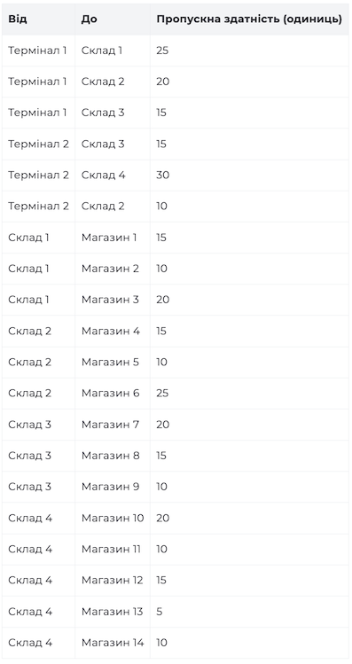
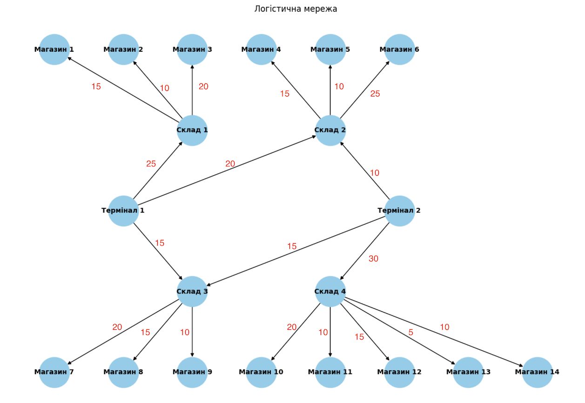

# Аналіз результатів моделювання логістичної мережі

## Опис задачі

Метою роботи є моделювання логістичної мережі постачання товарів від терміналів до магазинів через склади та визначення максимального можливого обсягу доставки з використанням алгоритму максимального потоку Едмондса–Карпа.

Логістична мережа складається з 2 терміналів, 4 складів і 14 магазинів. Кожне з’єднання між вузлами має задану пропускну здатність, яка обмежує кількість товару, що може бути передана цим маршрутом.

## Структура графа

Вершини:

- Термінали: T1, T2
- Склади: W1, W2, W3, W4
- Магазини: S1–S14
- Додаткові вершини: super_source (джерело), super_sink (стік)

Ребра:

- Включають зв’язки між терміналами і складами, складами і магазинами
- Пропускна здатність кожного ребра визначена згідно з таблицею

## Метод розв’язання

- Створено розширений граф з додатковими вершинами source та sink
- Ребра source → T1 та source → T2 отримали пропускну здатність, що відповідає загальному можливому виходу з кожного термінала
- Ребра S → sink отримали пропускну здатність, рівну сумі вхідних каналів до відповідного магазину
- Застосовано алгоритм Едмондса–Карпа для пошуку максимального потоку з source до sink

## Результати обчислень

Таблиця фактичних потоків

| Terminal     | Shop  | Actual Flow |
|--------------|-------|-------------|
| Terminal 1   | S1    | 15          |
| Terminal 1   | S2    | 10          |
| Terminal 1   | S4    | 15          |
| Terminal 1   | S5    | 5           |
| Terminal 1   | S7    | 15          |
| Terminal 2   | S10   | 20          |
| Terminal 2   | S11   | 10          |
| Terminal 2   | S5    | 5           |
| Terminal 2   | S6    | 5           |
| Terminal 2   | S7    | 5           |
| Terminal 2   | S8    | 10          |

**Загальний максимальний потік: 115 одиниць**

- T1: 60 одиниць
- T2: 55 одиниць

> **Примітка:**
У таблиці наведено лише ті магазини, які фактично отримали товар.
Для магазинів, до яких алгоритм не зміг доставити потік через обмеження пропускних здатностей, фактичний потік дорівнює 0, тому вони не включені до таблиці.

## Аналіз отриманих результатів

1. Досягнення оптимального потоку

Розрахунковий потік повністю відповідає сумарній пропускній здатності терміналів:

- T1: 25 + 20 + 15 = 60
- T2: 15 + 30 + 10 = 55
- Сума: 115 одиниць

Отже, досягнуто максимально можливого потоку, а розподіл є глобально оптимальним згідно з характеристиками заданої мережі.

## Аналіз за запитаннями

**1. Які термінали забезпечують найбільший потік товарів?**

- Термінал 1: 60 одиниць
- Термінал 2: 55 одиниць

**Висновок:** Найбільший потік забезпечує Термінал 1

⸻

**2. Які маршрути мають найменшу пропускну здатність?**

Найменші пропускні здатності мають такі ребра:

- w4 → s13: 5
- w2 → s5: 10
- w3 → s9: 10
- w4 → s14: 10
- t2 → w2: 10

Ці маршрути:

- обмежують постачання конкретних магазинів;
- призводять до того, що частина магазинів взагалі не отримує товар;
- не дозволяють повністю реалізувати потенціал складів.

⸻

**3. Які магазини отримали найменше товарів?**

- 0 одиниць: S3, S9, S12, S13, S14
- 5 одиниць: S6

Можливі покращення:

- збільшити w4 → s12, w4 → s13, w4 → s14;
- збільшити вхід до складу w2 або перерозподілити його навантаження.

⸻

**4. Вузькі місця мережі**

- Всі склади (w1, w2, w3, w4) є вузькими місцями у логістичній мережі.
- Потік товарів від терміналів до складів обмежує можливість повного постачання магазинів.

Наприклад:

- s3 не отримує товарів, оскільки t1 → w1 має обмежену пропускну здатність, яка повністю витрачається на s1 і s2.
- s6 здатен прийняти до 25 одиниць, але отримує лише 5, що вказує на обмеження на маршруті t2 → w2.

⸻

**5. Чи досягнуто оптимального потоку?**

Так, оптимального потоку досягнуто.

## Висновки

У роботі було:

- побудовано модель логістичної мережі;
- застосовано алгоритм Едмондса–Карпа;
- визначено максимальний потік та фактичні поставки;
- проаналізовано вузькі місця системи.

**Висновок:**

Для досягнення більш ефективного розподілу товарів у мережі потрібно збільшити пропускні здатності маршрутів між терміналами та складами. Це дозволить складам реалізувати увесь свій потенціал, а магазинам — отримати товари в повному обсязі згідно з їх потребами.
